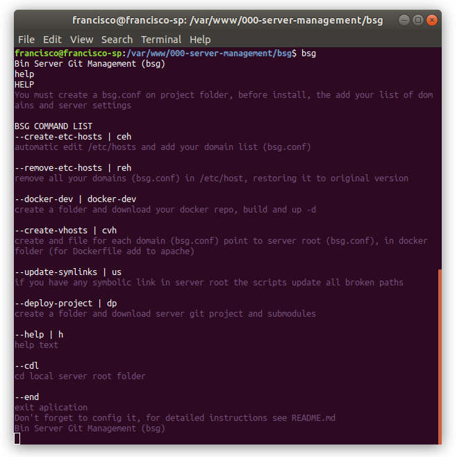

# bin-server-git-management-shell-2020

make easy for Francisco Matelli Matulovic to deploy Fnetwork

## Installation

download git repo, edit bsg.conf and ./install.sh

## Usage

Type 'bsg' anywhere in your shell

## Commands

```
--create-etc-hosts | ceh
automatic edit /etc/hosts and add your domain list (bsg.conf)

--remove-etc-hosts | reh
remove all your domains (bsg.conf) in /etc/host, restoring it to original version

--docker-dev | docker-dev
create a folder and download your docker repo, build and up -d

--create-vhosts | cvh
create and file for each domain (bsg.conf) point to server root (bsg.conf), in docker folder (for Dockerfile add to apache)

--update-symlinks | us
if you have any symbolic link in server root the scripts update all broken paths

--deploy-project | dp
create a folder and download server git project and submodules

--help | h
help text

--cdl
cd local server root folder

--end
exit aplication

```
